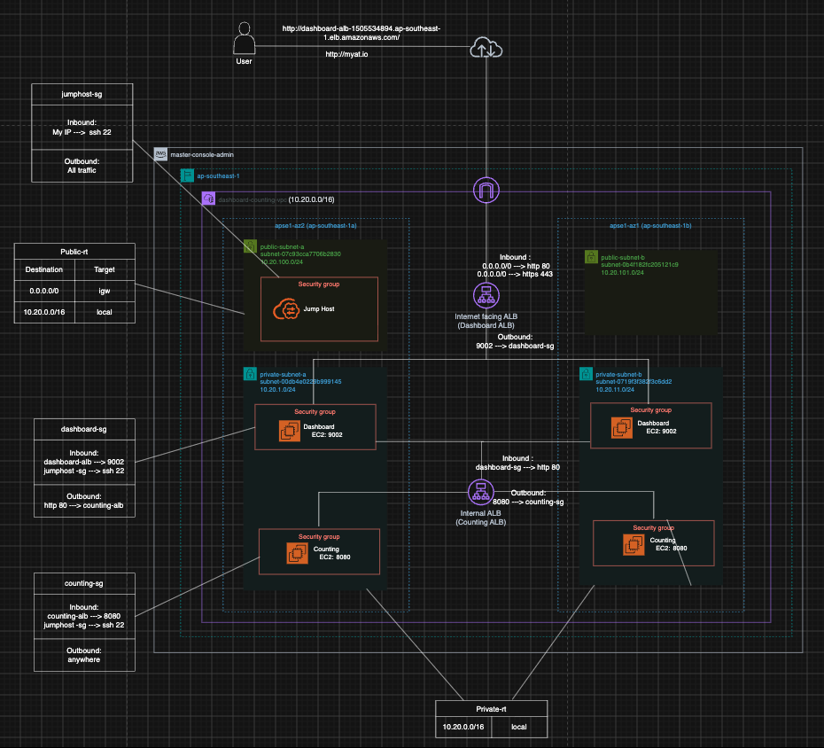

# Multi-Tier Highly Available AWS VPC Architecture

## Architecture Summary


This repository documents the step-by-step deployment of a secure, highly available, multi-tier web application architecture in AWS (`ap-southeast-1`).

---

##  Architecture Overview

- **VPC CIDR:** `10.20.0.0/16` (`dashboard-counting-vpc`)
- **Availability Zones:** `ap-southeast-1a` and `ap-southeast-1b`
- **Public Subnets:**
  - `public-subnet-a` (`10.20.100.0/24`)
  - `public-subnet-b` (`10.20.101.0/24`)
- **Private Subnets:**
  - `private-subnet-a` (`10.20.1.0/24`)
  - `private-subnet-b` (`10.20.11.0/24`)
- **Load Balancers:**
  - **Internet-Facing ALB (Dashboard ALB):** Routes external traffic to Dashboard EC2 instances on port `9002`.
  - **Internal ALB (Counting ALB):** Routes internal traffic from Dashboard instances to Counting EC2 instances on port `8080`.
- **Management:** Jump Host deployed in `public-subnet-a` for secure SSH administration.

---

##  Step-by-Step Deployment Guide

### Step 1: Networking Setup (VPC & Subnets)

1. **Create VPC:**
   - Name: `dashboard-counting-vpc`
   - IPv4 CIDR: `10.20.0.0/16`

2. **Create Subnets:**
   - **`public-subnet-a`**: `10.20.100.0/24` in `ap-southeast-1a`
   - **`public-subnet-b`**: `10.20.101.0/24` in `ap-southeast-1b`
   - **`private-subnet-a`**: `10.20.1.0/24` in `ap-southeast-1a`
   - **`private-subnet-b`**: `10.20.11.0/24` in `ap-southeast-1b`

3. **Configure Gateways & Route Tables:**
   - **Internet Gateway (IGW):** Create and attach to `dashboard-counting-vpc`.
   - **Public Route Table (`Public-rt`):**
     - Target `0.0.0.0/0` -> `Internet Gateway`
     - Target `10.20.0.0/16` -> `local`
     - Associate with `public-subnet-a` and `public-subnet-b`.
   - **Private Route Table (`Private-rt`):**
     - Target `10.20.0.0/16` -> `local`
     - Associate with `private-subnet-a` and `private-subnet-b`.

---

### Step 2: Configure Security Groups

Create the following Security Groups in `dashboard-counting-vpc`:

#### 1. `jumphost-sg`
- **Inbound:**
  - `SSH (22)` | Source: `My IP`
- **Outbound:**
  - `All traffic` | Destination: `0.0.0.0/0`

#### 2. `dashboard-alb-sg` (Internet-Facing ALB)
- **Inbound:**
  - `HTTP (80)` | Source: `0.0.0.0/0`
  - `HTTPS (443)` | Source: `0.0.0.0/0`
- **Outbound:**
  - `Custom TCP (9002)` | Destination: `dashboard-sg`

#### 3. `dashboard-sg` (Dashboard EC2 Instances)
- **Inbound:**
  - `Custom TCP (9002)` | Source: `dashboard-alb-sg`
  - `SSH (22)` | Source: `jumphost-sg`
- **Outbound:**
  - `HTTP (80)` | Destination: `counting-alb-sg`

#### 4. `counting-alb-sg` (Internal ALB)
- **Inbound:**
  - `HTTP (80)` | Source: `dashboard-sg`
- **Outbound:**
  - `Custom TCP (8080)` | Destination: `counting-sg`

#### 5. `counting-sg` (Counting EC2 Instances)
- **Inbound:**
  - `Custom TCP (8080)` | Source: `counting-alb-sg`
  - `SSH (22)` | Source: `jumphost-sg`
- **Outbound:**
  - `All traffic` | Destination: `0.0.0.0/0`

---

### Step 3: Launch EC2 Compute Instances

1. **Jump Host:**
   - Launch an EC2 instance in `public-subnet-a`.
   - Assign a Public IP.
   - Security Group: `jumphost-sg`.

2. **Dashboard Instances:**
   - Launch EC2 Instance 1 in `private-subnet-a`.
   - Launch EC2 Instance 2 in `private-subnet-b`.
   - Application Port: `9002`.
   - Security Group: `dashboard-sg`.

3. **Counting Instances:**
   - Launch EC2 Instance 1 in `private-subnet-a`.
   - Launch EC2 Instance 2 in `private-subnet-b`.
   - Application Port: `8080`.
   - Security Group: `counting-sg`.

---

### Step 4: Configure Load Balancers & Target Groups

#### 1. Internal ALB (Counting ALB)
- **Target Group (`counting-alb-tg`):**
  - Target Type: `Instances` | Protocol: `HTTP` | Port: `8080`
  - Register Counting instances in `private-subnet-a` and `private-subnet-b`.
- **Load Balancer:**
  - Scheme: **Internal**
  - Subnets: Select `private-subnet-a` and `private-subnet-b`.
  - Security Group: `counting-alb-sg`.
  - Listener: `HTTP:80` -> Forward to `counting-alb-tg`.

#### 2. Internet-Facing ALB (Dashboard ALB)
- **Target Group (`dashboard-alb-tg`):**
  - Target Type: `Instances` | Protocol: `HTTP` | Port: `9002`
  - Register Dashboard instances in `private-subnet-a` and `private-subnet-b`.
- **Load Balancer:**
  - Scheme: **Internet-facing**
  - Subnets: Select `public-subnet-a` and `public-subnet-b`.
  - Security Group: `dashboard-alb-sg`.
  - Listeners:
    - `HTTP:80` -> Forward to `dashboard-alb-tg`
    - `HTTPS:443` -> Forward to `dashboard-alb-tg`

---
### Step 5: Route 53 & Custom Domain Configuration

1. **Internal Routing via Route 53 Private Hosted Zone:**
   - Go to **Route 53** > **Hosted zones** > **Create hosted zone**.
   - Domain Name: `myat.io`
   - Type: **Private hosted zone for Amazon VPC**
   - VPC: Select `dashboard-counting-vpc` in `ap-southeast-1`.
   - Create an **A Record (Alias)**:
     - Record Name: `counting.myat.io`
     - Record Type: `A`
     - Enable **Alias** -> Route traffic to **Alias to Application Load Balancer**.
     - Choose region (`ap-southeast-1`) and select the **Internal Counting ALB**.
   - *Result:* Dashboard servers can now call `http://counting.myat.io` internally instead of using the raw ALB DNS name.

2. **Local Workstation Testing (`myat.io`):**
   - Resolve the IP address of my **Internet-Facing Dashboard ALB** via terminal:
     ```bash
     dig +short <dashboard-alb-dns-name>.amazonaws.com
     ```
   - Edit my local machine's `hosts` file (`/etc/hosts` on macOS/Linux) and map the ALB IP to `myat.io`:
     ```text
     <DASHBOARD_ALB_IP> myat.io
     ```
   - Open my browser and navigate to `http://myat.io` to test the full flow locally.
---

### Step 6: Verification & End-to-End Testing

1. **Bastion SSH & Internal DNS Verification:**
   - SSH into the Jump Host and hop onto a Dashboard EC2 instance:
     ```bash
     ssh -i key.pem ec2-user@<JUMP_HOST_PUBLIC_IP>
     ssh -i key.pem ec2-user@<DASHBOARD_PRIVATE_IP>
     ```
   - Verify internal domain resolution from the Dashboard instance:
     ```bash
     curl http://counting.myat.io:8080
     ```

2. **Public Browser Access:**
   - Navigate to `http://myat.io` (via local `/etc/hosts` mapping) or use the public ALB DNS name:
     `http://<dashboard-alb-dns-name>.amazonaws.com/`
